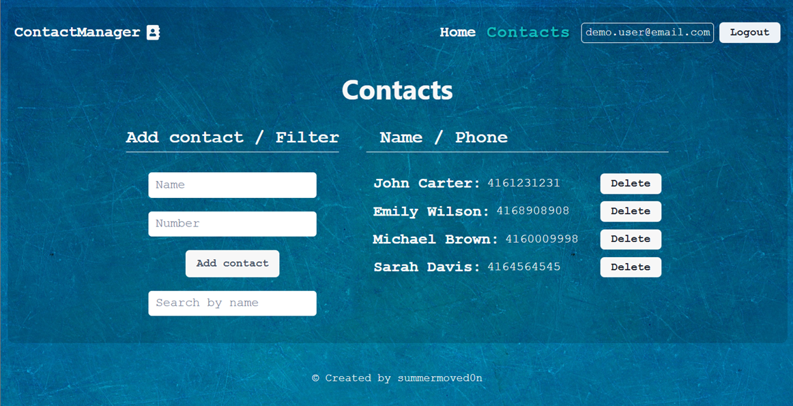

# Contact Manager Frontend

Responsive React frontend for the Contact Manager application. Users can create
an account, sign in, keep a private contact list, and quickly filter saved
contacts.

## Preview



## Live Demo

- **Frontend:** https://summermoved0n.github.io/Contact-Manager-Frontend/
- **Backend API:** https://contact-manager-backend-fb7b.onrender.com
- **Swagger Docs:** https://contact-manager-backend-fb7b.onrender.com/api-docs

## Related Repositories

- **Frontend Repository:**
  https://github.com/summermoved0n/Contact-Manager-Frontend
- **Backend Repository:**
  https://github.com/summermoved0n/Contact-Manager-Backend

## Features

- User registration, sign-in, and sign-out
- Persistent authentication between browser sessions
- Protected routes for authenticated users
- Add and delete personal contacts
- Filter contacts by name
- Loading indicators and toast notifications
- Responsive desktop and mobile interface
- Automatic deployment to GitHub Pages

## Tech Stack

- React 18
- Redux Toolkit
- React Redux
- Redux Persist
- React Router
- Axios
- Chakra UI
- Emotion
- Styled Components
- React Hot Toast

## Backend Integration

The application communicates with the Contact Manager Backend API for user
authentication and contact management.

### Main Endpoints

- `/api/users/register`
- `/api/users/login`
- `/api/users/logout`
- `/api/users/current`
- `/api/contacts`
- `/api/contacts/:id`

## Getting Started

### Prerequisites

Install a current LTS version of [Node.js](https://nodejs.org/), which includes
npm.

### Installation

```bash
git clone https://github.com/summermoved0n/Contact-Manager-Frontend.git
cd Contact-Manager-Frontend
npm install
```

### Development

The project is configured for automatic deployment to GitHub Pages.

```bash
npm start
```

Open the application in your browser:

http://localhost:3000

## Available Scripts

| Command           | Description                                |
| ----------------- | ------------------------------------------ |
| `npm start`       | Starts the development server              |
| `npm run build`   | Creates an optimized production build      |
| `npm run lint:js` | Runs ESLint for JavaScript and JSX files   |
| `npm test`        | Starts the test runner in interactive mode |

## Project Structure

```text
src/
|-- components/    Reusable interface and routing components
|-- images/        Application background images
|-- pages/         Home, login, registration, and contacts pages
|-- redux/         Store, slices, selectors, and async operations
|-- services/      API client and shared styles
`-- index.js       Application entry point
```

## Deployment

The project is configured for GitHub Pages deployment through the `homepage`
field in `package.json`.

To create the production build locally:

```bash
npm run build
```

## Author

**Dmytro Shulzhenko**

GitHub: https://github.com/summermoved0n
